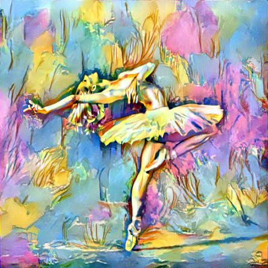
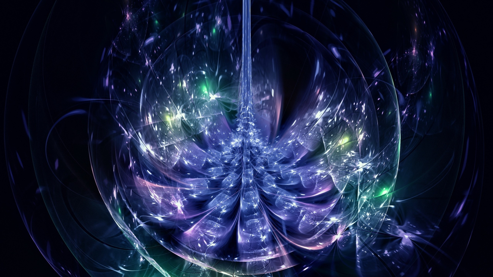
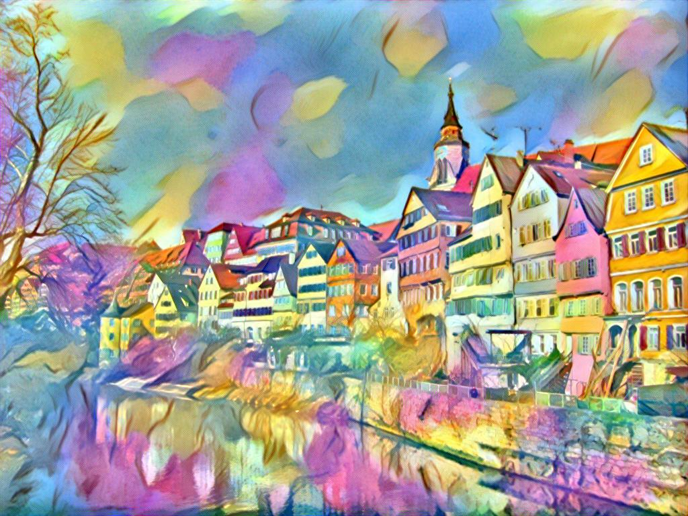
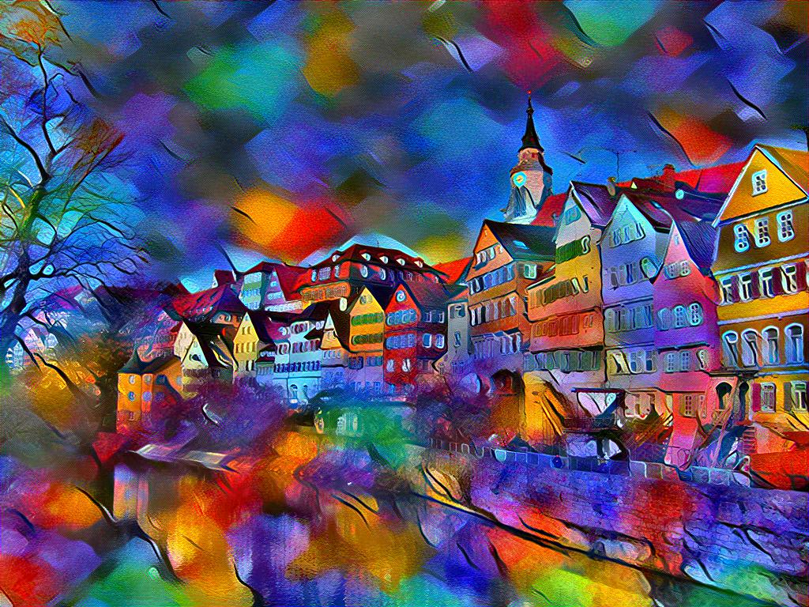
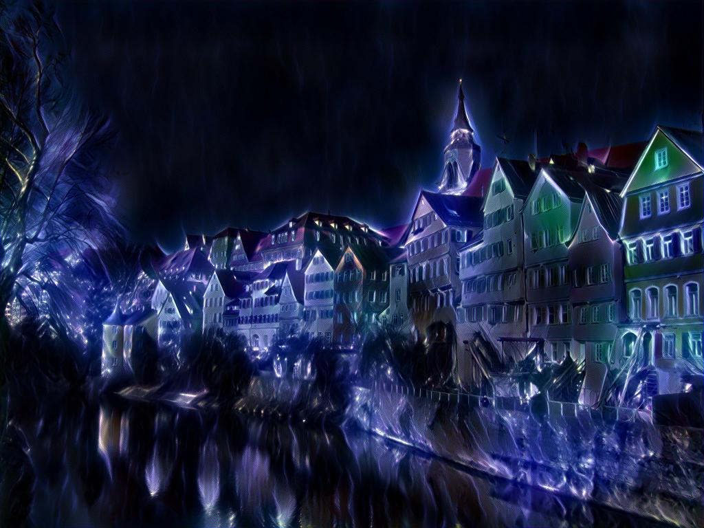
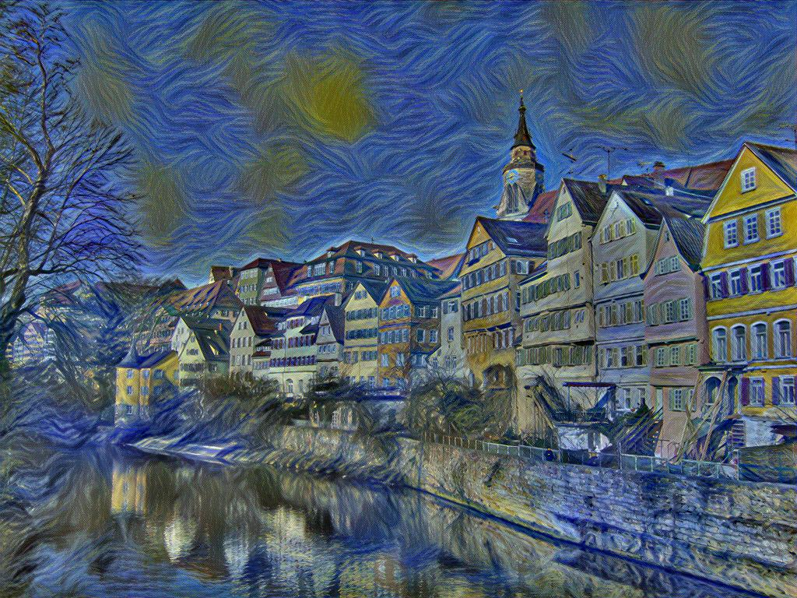

# Neural_Style_Transfer
This is a pyTorch implementation of the paper [A Neural Algorithm of Artistic Style](https://arxiv.org/pdf/1508.06576.pdf) by Leon A. Gatys, Alexander S. Ecker, and Matthias Bethge, which proposes an algorithm to combine content of one image and style of another image. Here shows one example result I get using this implementation by combing a ballet dancer and one painting.

ballet dancer|painting|result
-------------|----------------|------
||

With this algorithm, we can apply different styles from different images to the same content and get quite interesting results. Here I apply several styles to the Tubingen picture.

||||||
|---|---|---|---|---|
||||||

fdf

