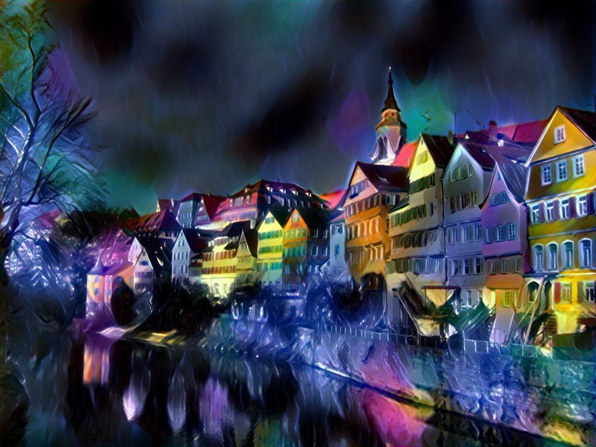

# Neural_Style_Transfer
This is a pyTorch implementation of the paper [A Neural Algorithm of Artistic Style](https://arxiv.org/pdf/1508.06576.pdf) by Leon A. Gatys, Alexander S. Ecker, and Matthias Bethge, which proposes an algorithm to combine content of one image and style of another image. Here shows one example result I get using this implementation by combing a ballet dancer and one painting.

ballet dancer|painting|result
-------------|----------------|------
||

With this algorithm, we can apply different styles from different images to the same content and get quite interesting results. Here I apply several styles to the Tubingen picture.

||||||
|---|---|---|---|---|
||||||

We can also apply more than one style to the same content at the same time and the weights of different style can adjusted. Below is an example I apply two styles with weight ration 3:7 to the Tubingen image.

<table>
  <tr>
    <td></td>
    <td></td>
    <td></td>
  </tr>
  <tr>
    <td></td>
    <td colspan="2"></td>
  </tr>
</table>

## Dependencies:
* Pytorch
* __Optional__:
    1. CUDA 
    2. cuDnn

## Usage:
Basic usage:
```
python NeuralStyle --sty_imgs <image.jpg> <image.jpg>... --con_img <image.jpg> --out <image.jpg>
```

