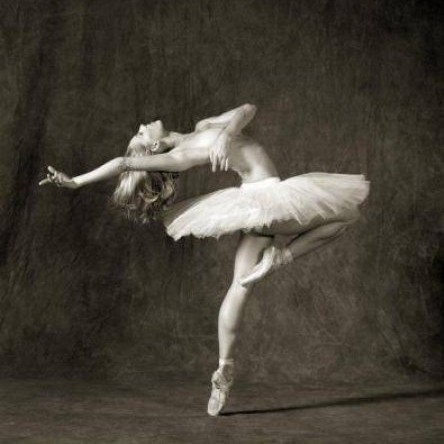
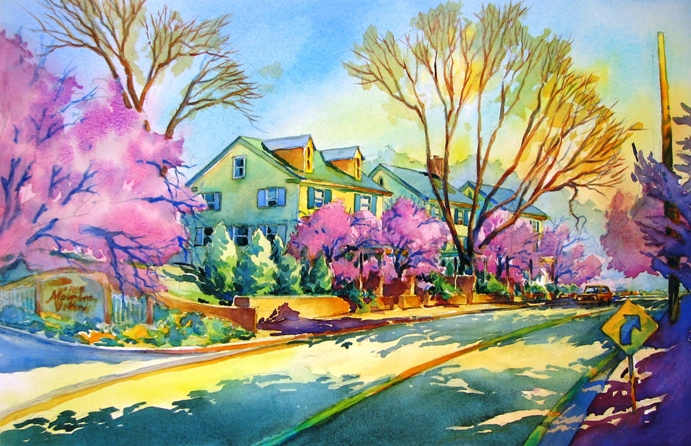

# Neural_Style_Transfer
This is a pyTorch implementation of the paper [A Neural Algorithm of Artistic Style](https://arxiv.org/pdf/1508.06576.pdf) by Leon A. Gatys, Alexander S. Ecker, and Matthias Bethge, which proposes an algorithm to combine content of one image and style of another image. Here shows one example result I get using this implementation by combing a ballet dancer and one painting.

ballet dancer|painting|result
-------------|----------------|------
||

With this algorithm, we can apply different styles from different images to the same content and get quite interesting results. Here I apply several styles to the Tubingen picture.

||||||
|---|---|---|---|---|
||||||

We can also apply more than one style to the same content at the same time and the weights of different styles can be adjusted. Below is an example I apply two styles with weight ration 3:7 to the Tubingen image.

<table>
  <tr>
    <td></td>
    <td></td>
    <td></td>
  </tr>
  <tr>
    <td></td>
    <td colspan="2"></td>
  </tr>
</table>

## Dependencies:
* Pytorch
* Optional:
    1. CUDA 
    2. cuDnn

## Usage:
**Basic usage**:
```
python NeuralStyle.py --sty_imgs <image.jpg> <image.jpg>... --con_img <image.jpg> --out <image.jpg>
```
You can type `python NeuralStyle.py -h` for help info.

**Options**:
* `--sty_imgs/-s`: File path(es) to the style image(s). If there are more than one style image, please separate them by space.
* `--style_blend_weights/-sbw`: Weights of different style to blend. This should have the same length as option `--sty_img/-s`. Please separate weights by space. Equal weights are assigned to different styles if it is left default.
* `--con_img/-c`: File path to the content image.
* `--out/-o`: File path to the output image.
* `--out_size/-os`: Size of the output image. By default, the output image has the same size as content image. You can specify the height and width by separating them with space like `h w`. If you only specify an Int, then the size of the output is determined by matching the smaller edge of the content image to this number while keeping the ratio.
* `--content_layers/-cls`: Layers used to reconstruct content. Please only use 'relu' and 'conv' in format 'relu_i' and 'conv_i' with 1<=i<=16. If there are more than one layer, specify them by space. Default is ['relu_4'].
* `--style_layers/-sls`: Layers used to reconstruct style. Please only use 'relu' and 'conv' in format 'relu_i' and 'conv_i' with 1<=i<=16. If there are more than one layer, specify them by space. Default is ['relu_1', 'relu_2', 'relu_3', 'relu_4', 'relu_5'].
* `--content_weight/-cw`: Weight of the reconstruction of the content. Default is 0.5.
* `--style_weight/-sw`: Weight of the reconstruction of the style. Default is 5000.0.
* `--optim`: Specify the optimization algorithm. Please choose from 'adam' and 'lbfgs'. Default is 'lbfgs'.
* `--learning_rate/-lr`: Learning rate for optimization algorithm. Default is 0.7.
* `--num_iter/-ni`: Number of the iterations. Default is 20.
* `--use_cuda/-uc`: Switch to use CUDA to accelerate computing on GPU.
* `--pooling/-p`: Type of pooling layer. Choose from 'max' and 'ave'. Default is 'ave'.
* `--init/-i`: Way to initializa the generated image. Choose from 'content' and 'random'. 'content' initializes the image with content image. 'random' initializes the image with random noise. Default is 'random'.
* `--print_iter/-pi`: Print progress every 'print_iter' iterations. Set to 0 to disable printing. Default is 1.
* `--save_iter/-si`: Save intermediate images every 'save_iter' iterations. Set to 0 to disable saving intermediate images. Default is 0.
